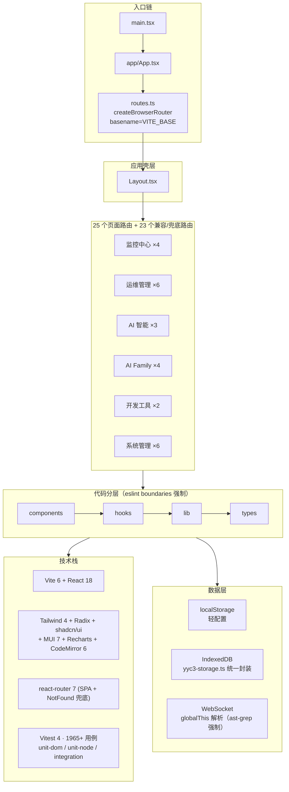
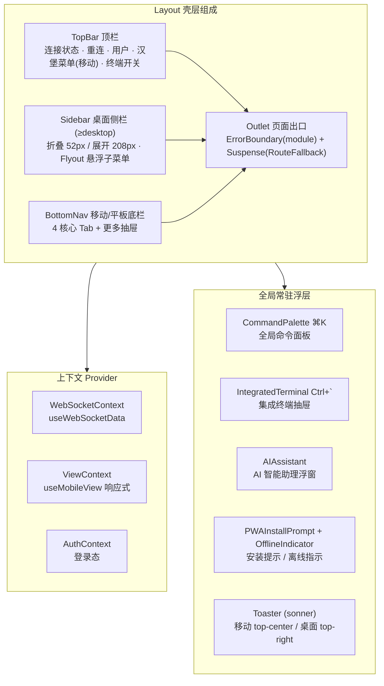
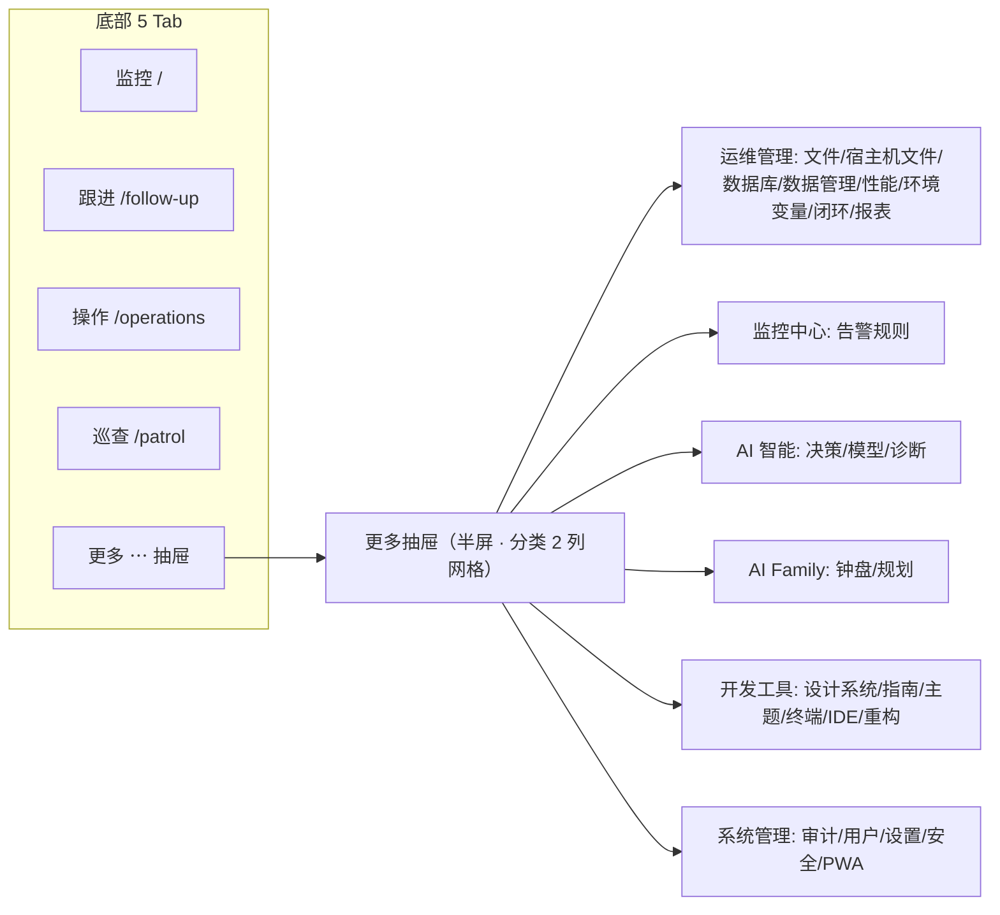

# YYC³ AI API Token Console · 全局导航功能架构可视化

> 版本: v1.0 · 生成日期: 2026-09-27
> 事实源对齐: `src/app/routes.ts`（路由表唯一事实源）· `src/app/components/Sidebar.tsx`（桌面导航）· `src/app/components/BottomNav.tsx`（移动导航）· `src/app/i18n/zh-CN.ts`（导航文案）
> 截图示例对齐: `public/一级导航-*/`（六组设计稿截图，CP-IM v9.x 原型 → 现行实现对照）

---

## 目录

1. [系统定位与技术栈架构](#1-系统定位与技术栈架构)
2. [应用壳层架构（Layout）](#2-应用壳层架构layout)
3. [全局导航全景图](#3-全局导航全景图)
4. [六大一级导航 · 路由与页面详解](#4-六大一级导航--路由与页面详解)
5. [AI Family 子路由分发体系](#5-ai-family-子路由分发体系)
6. [兼容重定向路由总表](#6-兼容重定向路由总表)
7. [设计稿截图 ↔ 现行路由对照矩阵](#7-设计稿截图--现行路由对照矩阵)
8. [移动端导航体系](#8-移动端导航体系)
9. [导航实现约定与新增页面清单](#9-导航实现约定与新增页面清单)

---

## 1. 系统定位与技术栈架构

**一句话定位**：本地闭环多端推理矩阵数据看盘系统 —— 纯前端 SPA，GitHub Pages 部署 `token.yyc3.vip`，localStorage（轻配置）+ IndexedDB（大数据）双存储，零后端依赖。



---

## 2. 应用壳层架构（Layout）

所有页面路由均渲染在 `Layout` 之下。壳层提供常驻全局能力，与具体页面解耦：



要点：

- **快捷键**（`useKeyboardShortcuts`）：`⌘/Ctrl+K` 命令面板、``Ctrl+` `` 集成终端、`Esc` 逐层关闭。
- **AI Family 独立布局**：`/ai-family`、`/ai-family-design` 走全幅内容区（去掉内边距），其余页面按断点施加 padding，移动/平板预留 72px 底栏高度。
- **设计稿对照**：截图顶栏的 `⌘K 搜索`、`模拟模式`、`终端 >_`、`通知`、`简体中文` 分别对应 CommandPalette、模拟数据开关、IntegratedTerminal、通知入口、i18n 中英切换。

---

## 3. 全局导航全景图

桌面侧栏 `NAV_CATEGORIES` 定义六大一级导航（分类点击 = 跳转首个子项），与 `routes.ts` 一一对应：

```mermaid
flowchart LR
    ROOT["YYC³ Console<br/>Layout 壳"] ::: root

    subgraph MON["① 监控中心 Activity"]
        M1["/ 数据监控"]
        M2["/follow-up 一键跟进"]
        M3["/patrol 巡查模式"]
        M4["/alerts 告警规则"]
    end

    subgraph OPS["② 运维管理 Wrench"]
        O1["/operations 操作中心"]
        O2["/files 文件管理"]
        O3["/database 数据库管理"]
        O4["/connection-test 连接测试"]
        O5["/loop 服务闭环"]
        O6["/reports 报表导出"]
    end

    subgraph AIC["③ AI 智能 Brain"]
        A1["/ai AI 决策"]
        A2["/models 模型管理"]
        A3["/ai-diagnosis AI 诊断"]
    end

    subgraph AIF["④ AI Family UserCircle"]
        F1["/ai-family 12小时钟盘"]
        F2["/ai-family-center Family 中心"]
        F3["/ai-family-design Family 规划"]
        F4["/ai-family-sub/:subpage<br/>14 个懒加载子页"]
    end

    subgraph DEV["⑤ 开发工具 Code2"]
        D1["/design-system 设计系统"]
        D2["/dev-guide 开发指南"]
    end

    subgraph ADM["⑥ 系统管理 ShieldCheck"]
        S1["/audit 操作审计"]
        S2["/users 用户管理"]
        S3["/settings 系统设置(12分区)"]
        S4["/security 安全监控"]
        S5["/pwa PWA 管理"]
        S6["/env-config 环境变量"]
    end

    ROOT --> MON
    ROOT --> OPS
    ROOT --> AIC
    ROOT --> AIF
    ROOT --> DEV
    ROOT --> ADM

    classDef root fill:#0a1628,stroke:#00d4ff,color:#00d4ff,stroke-width:2px;
```

> 侧栏中保留的 `/host-files`、`/db-connections`、`/theme`、`/terminal`、`/ide`、`/refactoring`、`/architecture`、`/data-editor`、`/performance` 等入口在路由层自动 301 语义重定向到收敛后的页面，详见 [§6](#6-兼容重定向路由总表)。

---

## 4. 六大一级导航 · 路由与页面详解

### 4.1 ① 监控中心（`monitor` · 4 路由）

| 路由 | 中文导航 | 组件 | 页面核心能力（对齐截图） |
| --- | --- | --- | --- |
| `/`（index） | 数据监控 | `DataMonitoring` | KPI 六卡（QPS/延迟/活跃节点/GPU/吞吐/存储）、推理吞吐趋势、模型负载分布环形图、性能雷达、模型对比、负载预测（AI 预测）、节点矩阵、实时操作流、告警横幅一键跟进 |
| `/follow-up` | 一键跟进 | `FollowUpPanel` | 告警跟进任务看板（设计稿「协同管理」页的能力收敛处）：总数/待处理/进行中/已完成/已过期、优先级与负责人筛选、标记完成/开始处理 |
| `/patrol` | 巡查模式 | `PatrolDashboard` | 系统健康巡检仪表盘 |
| `/alerts` | 告警规则 | `AlertRulesPanel` | 告警规则 CRUD 与阈值配置 |

### 4.2 ② 运维管理（`ops` · 6 路由 + 2 重定向入口）

| 路由 | 中文导航 | 组件 | 页面核心能力（对齐截图） |
| --- | --- | --- | --- |
| `/operations` | 操作中心 | `OperationCenter` | 快速操作 12 卡（重启节点/部署模型/清理缓存/导出日志/生成报告/批量重启/模型迁移/暂停队列/恢复队列/健康检查/备份配置/自定义脚本）+ 操作模板（新建/执行/删除），按 全部/节点/模型/任务/系统/自定义 分类 |
| `/files` | 文件管理 | `LocalFileManager` | 本地文件浏览管理（`/host-files` 宿主机文件重定向至此） |
| `/database` | 数据库管理 | `DatabaseManager` | IndexedDB 数据管理（`/db-connections` 连接配置、`/data-editor` 数据管理重定向至此） |
| `/connection-test` | 连接测试 | `ServiceConnectionTest` | 服务连通性测试 |
| `/loop` | 服务闭环 | `ServiceLoopPanel` | 服务问题闭环处理流程 |
| `/reports` | 报表导出 | `ReportExporter` | 系统报表导出 |

### 4.3 ③ AI 智能（`ai` · 3 路由）

| 路由 | 中文导航 | 组件 | 页面核心能力（对齐截图） |
| --- | --- | --- | --- |
| `/ai` | AI 决策 | `AISuggestionPanel` | AI 辅助决策（截图含 决策面板 / 对话 / Family 三种上下文形态） |
| `/models` | 模型管理 | `ModelProviderPanel` | 服务商注册表（Z.ai / Kimi / DeepSeek / 火山引擎 / OpenAI / Ollama 本地…声明式 JSON+zod 配置）、Ollama 本地模型探测、已配置模型 CRUD、导入/导出、添加模型 |
| `/ai-diagnosis` | AI 诊断 | `AIDiagnostics` | AI 故障/异常诊断 |

> 截图「SDK 对话」无独立路由 —— 对话能力收敛为壳层全局 `AIAssistant` 浮窗（见 §2），可调用 `/models` 注册的任意模型。

### 4.4 ④ AI Family（`ai-family` · 3 懒加载路由 + 1 动态分发 + 14 兼容入口）

| 路由 | 中文导航 | 加载方式 | 说明 |
| --- | --- | --- | --- |
| `/ai-family` | AI Family | `React.lazy` + `LazyWrap` | 12 小时钟盘主页：八位家人角色按时辰轮值（元启·天枢 / 语枢·万物 / 千里·伯乐 / 创想·灵韵 / 智云·守护 / 格物·宗师 / 言启·千行 / 预见·先知），在线家人/活跃任务/运行时间状态 |
| `/ai-family-center` | Family 中心 | `React.lazy` + `LazyWrap` | Family 管理中心 |
| `/ai-family-design` | Family 规划 | `React.lazy` + `LazyWrap` | 设计文档页 |
| `/ai-family-sub/:subpage` | 14 个子项 | `AIFamilyRouter` 懒加载分发 | 子页参数表见 [§5](#5-ai-family-子路由分发体系) |

### 4.5 ⑤ 开发工具（`dev` · 2 路由 + 5 重定向入口）

| 路由 | 中文导航 | 组件 | 页面核心能力（对齐截图） |
| --- | --- | --- | --- |
| `/design-system` | 设计系统 | `DesignSystemPage` | Design Tokens（色彩/字体/间距/阴影/动效）、组件库（Atoms→Templates）、阶段审核总结 |
| `/dev-guide` | 开发指南 | `DevGuidePage` | 开发规范文档；终端/IDE/重构分析/架构审计四类纯展示开发工具的收敛落地页 |

> 设计稿「终端」已由独立页面收敛为壳层全局 `IntegratedTerminal`（``Ctrl+` `` 唤起），「主题定制」收敛至 `/settings`。

### 4.6 ⑥ 系统管理（`admin` · 6 路由 + 2 重定向入口）

| 路由 | 中文导航 | 组件 | 页面核心能力（对齐截图） |
| --- | --- | --- | --- |
| `/audit` | 操作审计 | `OperationAudit` | 操作审计日志 |
| `/users` | 用户管理 | `UserManagement` | 用户与角色管理 |
| `/settings` | 系统设置 | `SystemSettings` | 12 分区设置（见下） |
| `/security` | 安全监控 | `SecurityMonitor` | 安全监控（`/performance` 性能监控重定向至此） |
| `/pwa` | PWA 管理 | `PWAStatusPanel` | PWA 状态/离线管理 |
| `/env-config` | 环境变量 | `EnvConfigEditor` | 环境变量配置（只读展示 + 文档指引，红线：零硬编码密钥） |

**`/settings` 侧栏 12 分区**（`settings/shared.tsx` `settingsSections`，与设计稿「二级导航-系统设定」11 张截图逐一对应）：

`general 通用设置` · `network 网络配置` · `cluster 集群配置` · `model 模型管理` · `storage 存储配置` · `websocket WebSocket` · `ai AI-LLM` · `pwa PWA离线` · `security 安全设置` · `notification 通知配置` · `env 环境变量` · `advanced 高级设置`

---

## 5. AI Family 子路由分发体系

`/ai-family-sub/:subpage` 由 `AIFamilyRouter` 统一分发，`lazyMap` 按需加载 14 个子页，加载失败自动回退静态 import，并以 `LazyErrorBoundary` 兜底。设计稿侧栏（AI-FAmily 组截图）与现行子页完全对齐：

```mermaid
flowchart TB
    R["AIFamilyRouter<br/>/ai-family-sub/:subpage"] ::: hub

    R --> HOME["home 家园首页<br/>FamilyHome"]
    R --> CHAT["chat 家人对话<br/>FamilyChat"]
    R --> SHARE["share 分享空间<br/>FamilyShare"]
    R --> LEARN["learn 学习成长<br/>FamilyLearn"]
    R --> MUSIC["music 音乐资讯<br/>FamilyMusic"]
    R --> GROWTH["growth 成长轨迹<br/>FamilyGrowth"]
    R --> PHONE["phone 家人热线<br/>FamilyPhone"]
    R --> FUN["fun 文娱中心<br/>FamilyEntertainment"]
    R --> ACT["activities 全家活动<br/>FamilyActivityCenter"]
    R --> MODELS["models 模型控制<br/>FamilyModelSettings"]
    R --> VOICE["voice 语音系统<br/>FamilyVoiceSystem"]
    R --> DATA["data 数据中心<br/>FamilyDataHub"]
    R --> COMM["comm 通信中心<br/>FamilyCommCenter"]
    R --> SET["settings 生态控制<br/>FamilyUISettings"]

    OLD["14 条旧兼容路径<br/>/ai-family-home · /ai-family-chat · … · /ai-family-settings"] -->|直接渲染分发器| R

    classDef hub fill:#0a1628,stroke:#7b2ff7,color:#e0f0ff,stroke-width:2px;
```

14 条旧路径（`/ai-family-home` … `/ai-family-settings`）不再各挂页面组件，统一渲染 `AIFamilyRouter` 由 `useParams`/`useLocation` 解析目标子页，保证历史链接与侧栏入口双兼容。

---

## 6. 兼容重定向路由总表

路由收敛原则：**重叠页面只保留一个事实源，旧路径 `<Navigate replace>` 重定向**，路由总数只减不增。

| 旧路径（侧栏/历史入口） | 重定向至 | 收敛原因 |
| --- | --- | --- |
| `/host-files` 宿主机文件 | `/files` | 文件管理同一事实源 |
| `/db-connections` 连接配置 | `/database` | 数据库连接并入数据库管理 |
| `/data-editor` 数据管理 | `/database` | 数据编辑并入数据库管理 |
| `/terminal` 终端 | `/dev-guide` | 终端收敛为全局 `IntegratedTerminal`（``Ctrl+` ``） |
| `/ide` IDE | `/dev-guide` | 纯展示开发工具页精简 |
| `/refactoring` 重构分析 | `/dev-guide` | 同上 |
| `/architecture` 架构审计 | `/dev-guide` | 同上 |
| `/theme` 主题定制 | `/settings` | 主题并入系统设置 |
| `/performance` 性能监控 | `/security` | 性能与安全监控合并 |
| `*`（未匹配） | `NotFound` | SPA 兜底，GitHub Pages 配合 `404.html` |

---

## 7. 设计稿截图 ↔ 现行路由对照矩阵

覆盖 `public/一级导航-*/` 全部 6 组截图。状态图例：✅ 已实现直连 · 🔁 已收敛（重定向/合并）· 🧩 收敛为全局组件 · 📐 设计稿规划项（当前未建路由）。

### 7.1 监控中心（5 张）

| 截图 | 现行路由 | 状态 |
| --- | --- | --- |
| 监控中心-数据监控 | `/` DataMonitoring | ✅ |
| 监控中心-一键跟进 | `/follow-up` FollowUpPanel | ✅ |
| 监控中心-巡查模式 | `/patrol` PatrolDashboard | ✅ |
| 监控中心-告警规则 | `/alerts` AlertRulesPanel | ✅ |
| 监控中心-协同管理 | `/follow-up` | 🔁 设计稿独立任务看板，能力并入一键跟进 |

### 7.2 运维管理（9 张）

| 截图 | 现行路由 | 状态 |
| --- | --- | --- |
| 运维管理-操作中心 | `/operations` | ✅ |
| 运维管理-文件管理 | `/files` | ✅ |
| 运维管理-宿主机文件 | `/host-files` → `/files` | 🔁 |
| 运维管理-数据库管理 | `/database` | ✅ |
| 运维管理-连接配置 | `/db-connections` → `/database` | 🔁 |
| 运维管理-连接测试 | `/connection-test` | ✅ |
| 运维管理-服务闭环 | `/loop` | ✅ |
| 运维管理-报表导出 | `/reports` | ✅ |
| 运维管理-数据备份（配置中心） | `/settings` + 操作中心「备份配置」 | 🔁 设计稿配置中心，导入/导出能力分散至设置与报表 |

### 7.3 AI 智能（4 + 3 张）

| 截图 | 现行路由 | 状态 |
| --- | --- | --- |
| AI智能-模型管理 | `/models` | ✅ |
| AI-决策/AI辅助决策（含 -对话 / -Family） | `/ai` | ✅ |
| AI智能-AI诊断 | `/ai-diagnosis` | ✅ |
| AI智能-SDK对话 | 全局 `AIAssistant` 浮窗 | 🧩 |

### 7.4 AI Family（18 张）

| 截图 | 现行路由 | 状态 |
| --- | --- | --- |
| AI-FAmily（12小时钟盘） | `/ai-family` | ✅ |
| Family中心 | `/ai-family-center` | ✅ |
| 家族规划 | `/ai-family-design` | ✅ |
| 家族首页 | `/ai-family-sub/home` | ✅ |
| 交流中心 | `/ai-family-sub/chat`（现名「家人对话」） | ✅ |
| 分享空间 | `/ai-family-sub/share` | ✅ |
| 知识学习 | `/ai-family-sub/learn`（现名「学习成长」） | ✅ |
| 音乐空间 | `/ai-family-sub/music`（现名「音乐资讯」） | ✅ |
| 共同成长 | `/ai-family-sub/growth`（现名「成长轨迹」） | ✅ |
| 家人热线 | `/ai-family-sub/phone` | ✅ |
| 文娱中心 | `/ai-family-sub/fun` | ✅ |
| 活动中心 | `/ai-family-sub/activities`（现名「全家活动」） | ✅ |
| 模型设置 | `/ai-family-sub/models`（现名「模型控制」） | ✅ |
| 语音系统 | `/ai-family-sub/voice` | ✅ |
| 数据中心 | `/ai-family-sub/data` | ✅ |
| 通讯中心 / 通信基站 | `/ai-family-sub/comm`（现名「通信中心」） | ✅ |
| Family设置 | `/ai-family-sub/settings`（现名「生态控制」） | ✅ |

### 7.5 开发工具（7 张）

| 截图 | 现行路由 | 状态 |
| --- | --- | --- |
| 开发工具-设计系统 | `/design-system` | ✅ |
| 开发工具-开发指南 | `/dev-guide` | ✅ |
| 开发工具-主题定制 | `/theme` → `/settings` | 🔁 |
| 开发工具-终端 | `/terminal` → `/dev-guide`；终端为全局 `IntegratedTerminal` | 🔁🧩 |
| 开发工具-IDE | `/ide` → `/dev-guide` | 🔁 |
| 开发工具-架构审计 | `/architecture` → `/dev-guide` | 🔁 |
| 开发工具-重构分析 | `/refactoring` → `/dev-guide` | 🔁 |

### 7.6 系统管理（9 + 11 张）

| 截图 | 现行路由 | 状态 |
| --- | --- | --- |
| 系统设置-统一设置 / 系统设置 | `/settings` | ✅ |
| 系统设置-操作审计 | `/audit` | ✅ |
| 系统设置-用户管理 | `/users` | ✅ |
| 系统设置-安全监控 | `/security` | ✅ |
| 系统设置-PWA管理 | `/pwa` | ✅ |
| 系统设置-环境变量 | `/env-config` | ✅ |
| 系统设置-数据管理 | `/data-editor` → `/database` | 🔁 |
| 系统设置-性能-监控 | `/performance` → `/security` | 🔁 |
| 二级导航-系统设定：通用设置/集群配置/模型管理/存储配置/WebSocket/AI-LLM/PWA离线/安全设置/通知配置/环境变量/高级设置 | `/settings` 12 分区（另含 `network 网络配置`） | ✅ |

📐 **设计稿规划、暂未建路由的项**：`智慧酒店`、`酒店控制台`（系统管理稿侧栏）——属原型探索页，未纳入 `routes.ts`，遵循「路由只减不增」原则待需求确认后再评估。

---

## 8. 移动端导航体系

移动端/平板（`useMobileView` 判定）不渲染 Sidebar，改用 `BottomNav`：



- 拇指热区：最小触控 48×48；激活态顶部发光条 + 图标 drop-shadow。
- 安全区：`env(safe-area-inset-bottom)` 适配 iPhone notch；内容区预留 72px 底栏高度。
- 更多抽屉：路由变化自动关闭，开启时锁定 body 滚动。

---

## 9. 导航实现约定与新增页面清单

**导航数据流**：`Sidebar.NAV_CATEGORIES` / `BottomNav.MORE_CATEGORIES`（图标+路径）→ `useNavigate` 跳转 → `routes.ts` 匹配 → 懒加载/直挂组件 → `i18n zh-CN/en-US` 渲染文案。

**新增一个导航页面必须同步四处**（缺一即产生盲链或乱码 key）：

1. `src/app/routes.ts` —— 注册路由（遵守 §6 收敛原则，优先复用既有页面）
2. `src/app/components/Sidebar.tsx` —— `NAV_CATEGORIES` 挂载（桌面入口）
3. `src/app/components/BottomNav.tsx` —— 核心 Tab 或「更多」抽屉挂载（移动入口）
4. `src/app/i18n/zh-CN.ts` + `en-US.ts` —— `nav.*` 文案键（Sidebar/BottomNav 仅存 key，渲染走 `useI18n`）

**技术红线回顾**：组件体量门禁 `pnpm size:check` 基线只减不增；`ui/shadcn` 生成物禁手改；分层依赖 `components → hooks → lib → types` 由 eslint boundaries 强制；新增依赖精确锁版本。

---

*本文档为导航/路由/截图三方对齐的静态快照，后续路由变更请同步更新本文件（更新时以 `routes.ts` 实况为准重新生成对照矩阵）。*
