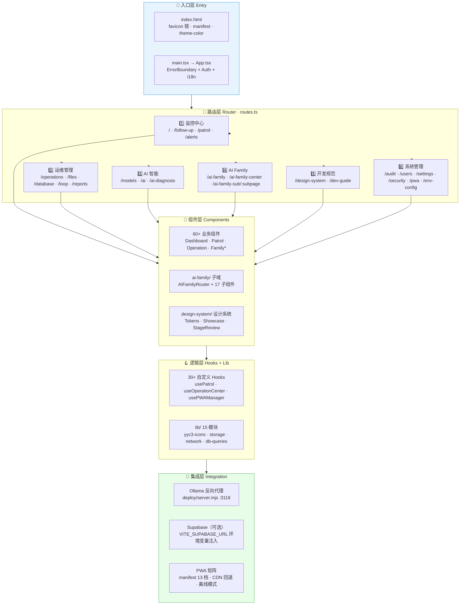
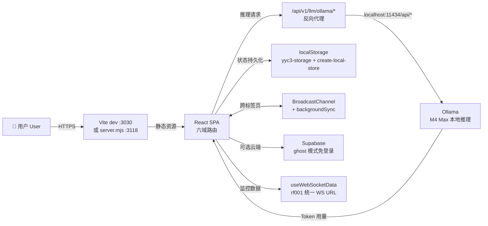
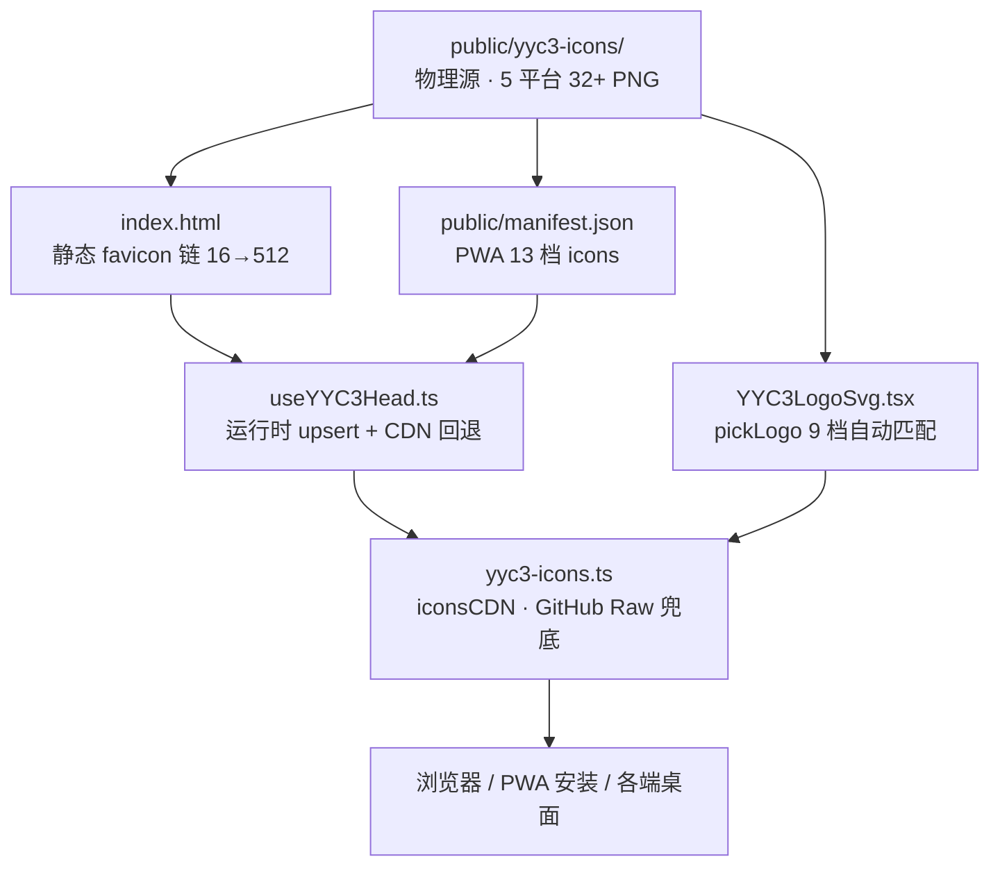

# 架构总览 | Architecture Overview

> **_YanYuCloudCube_**
> _言启象限 | 语枢未来_
> **_Words Initiate Quadrants, Language Serves as Core for Future_**
> _万象归元于云枢 | 深栈智启新纪元_
> **_All things converge in cloud pivot; Deep stacks ignite a new era of intelligence_**

---

## 📋 目录

- [一、技术栈全景](#一技术栈全景)
- [二、六域五层架构图](#二六域五层架构图)
- [三、全链路数据流](#三全链路数据流)
- [四、图标体系消费链](#四图标体系消费链)
- [五、目录结构映射](#五目录结构映射)
- [六、关键设计决策](#六关键设计决策)

---

## 一、技术栈全景 | Tech Stack

| 层级 Layer | 技术 Tech | 版本 Version | 用途 Purpose |
| ---------- | --------- | ------------ | ------------ |
| 构建 Build | Vite | 6.3.5 | dev server :3030 · 生产构建 · 子路径部署（`VITE_BASE`） |
| UI 框架 | React | 18.3.1 | SPA · `createBrowserRouter` 路由（react-router 7.13） |
| 类型系统 | TypeScript | strict mode | `tsc --noEmit` 零错误门禁 |
| 样式 Styling | Tailwind CSS | 4.1.12 | `@tailwindcss/vite` 插件式集成 · Design Tokens |
| 组件库 UI Kit | shadcn/ui + Radix UI | 29 原语 | Accordion→Tooltip 全量接入，WCAG 可达性基线 |
| 图表 Charts | Recharts | 2.15.2 | 钟盘 / 监控可视化 |
| 编辑器 Editor | CodeMirror 6 | 6.x | SQL/JSON/MD 多语言在线编辑（8 种语言包） |
| 状态 State | 自研 create-local-store | — | localStorage 持久化 + 跨标签页同步 |
| 测试 Test | Vitest 4 | 4.0.18 | dom/node 双项目工作区 · 覆盖率 80% 门槛 |
| a11y 审计 | axe-core | 4.11.1 | `a11y-audit.test.tsx` 可达性回归 |
| PWA | manifest + useYYC3Head | — | 13 档图标 · 运行时 head 注入 · CDN 回退 |
| 部署 Deploy | deploy/server.mjs | Node 22 | 零依赖静态托管 + Ollama 反向代理（:3118） |
| 包管理 | pnpm | 11.x | workspace 单包模式（`packages: ['.']`） |
| CI | GitHub Actions | — | 四阶段流水线 + tag 触发发布 |

---

## 二、六域五层架构图 | Six-Domain Five-Layer Architecture

---

## 三、全链路数据流 | End-to-End Data Flow

| 链路 Chain | 说明 Description |
| ---------- | ---------------- |
| 推理链路 | SPA → server.mjs 代理 → Ollama 本地集群（M4 Max / iMac / NAS），Token 用量回写钟盘 |
| 持久链路 | `yyc3-storage` 统一存储门面 → localStorage → 跨标签页 BroadcastChannel 同步 |
| 监控链路 | `useWebSocketData`（rf001 URL 统一）→ NodeDetailModal → 告警规则引擎 |
| 离线链路 | `useOfflineMode` + `backgroundSync` → 恢复联网自动补传 |
| 错误链路 | 全局监听（capture phase）→ `error-handler` → `ErrorBoundary` → 日志双写（rf002） |

---

## 四、图标体系消费链 | Icon System Chain

> 详细矩阵与路径规范见 [YYC3-图标可视化-架构展示.md](./YYC3-图标可视化-架构展示.md)。

---

## 五、目录结构映射 | Directory Mapping

| 目录 Dir | 职责 Role | 关键入口 Entry |
| -------- | --------- | -------------- |
| `src/app/components/` | 60+ 业务组件（六域页面 + 通用） | `Dashboard` · `OperationCenter` · `SystemSettings` |
| `src/app/components/ai-family/` | AI Family 子域（lazy 加载） | `AIFamilyRouter` · `FamilyHome` |
| `src/app/components/design-system/` | 内嵌设计系统 | `DesignSystemPage` /design-system |
| `src/app/hooks/` | 30+ 自定义 Hooks | `useI18n` · `usePWAManager` · `usePatrol` |
| `src/app/lib/` | 纯逻辑工具层（node 测试覆盖） | `yyc3-icons` · `yyc3-storage` · `error-handler` |
| `src/app/__tests__/` | 140+ 测试（dom/node 双项目） | `a11y-audit` · `i18n-consistency` · `rf00*` 回归 |
| `deploy/` | 零依赖部署 +launchd/nginx 配置 | `server.mjs` · `com.yyc3.dashboard.plist` |
| `scripts/` | 工具脚本 | `check_mermaid.py`（pre-commit 闸） |
| `docs/YYC3-AI-Family-团队规范/` | 标规文档 + 模版闭环 + 验收体系 | 五维驱动 · 开发标准 · 文档闭环 |
| `docs/YYC3-开发者文档/` | 开发者文档（本目录） | ARCHITECTURE · CICD · LABELS · RELEASE |

---

## 六、关键设计决策 | Key Design Decisions

| # | 决策 Decision | 选择 Choice | 理由 Rationale |
|---|---------------|------------|----------------|
| 1 | 构建工具 | Vite 6（非 Next.js） | 纯前端 SPA + 本地推理矩阵场景，无需 SSR；`VITE_BASE` 子路径部署满足 NAS 反代 |
| 2 | 状态管理 | 自研 store + localStorage | 本地闭环优先，零后端依赖；Supabase 仅作可选增强（ghost 模式） |
| 3 | 测试策略 | Vitest 4 projects 工作区 | `.tsx`→jsdom 组件测试 / `.ts`→node 纯函数，双轨覆盖率 80% 门槛 |
| 4 | 图标架构 | 物理源 + 逻辑源 + CDN 三级 | 单一事实源，四级兜底（静态→清单→运行时→CDN），零断链 |
| 5 | 部署形态 | Node 原生 http 零依赖 | 无 npm 依赖 = 无供应链风险；内置 Ollama 代理免去 nginx 复杂度（nginx.conf 备选） |
| 6 | 错误治理 | 三层拦截（capture→handler→boundary） | Figma iframe 宿主环境噪声静默 + Vite HMR 动态导入自恢复 |
| 7 | 端口规范 | dev 3030 / serve 3118 | 遵循团队「3200-3500 默认，3000-3199 受限」端口纪律 |
| 8 | 文档驱动 | 文档讲 why · 代码讲 how | 标规文档（标规文档/）定义标准，模版闭环提供 CI/文档/发布蓝本 |

---

**® YANYUCLOUDCUBE** · © 2025-2026 言语（河南）智能科技有限公司 · Yanyu Intelligent Technology Co., Ltd.

