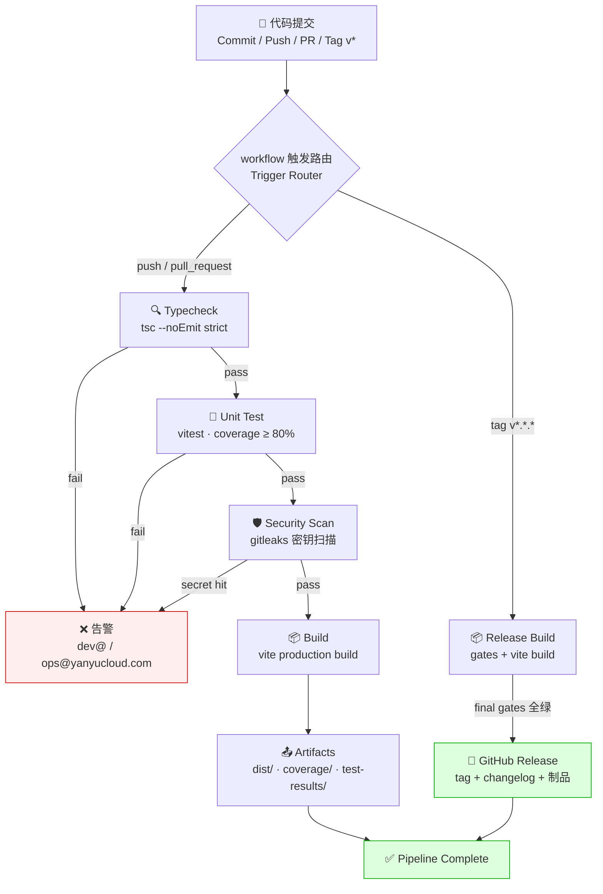

<div align="center">

# CI/CD 流水线详解 | CI/CD Pipeline Reference

> **_YanYuCloudCube_**
> _言启象限 | 语枢未来_
> **_Words Initiate Quadrants, Language Serves as Core for Future_**
> _万象归元于云枢 | 深栈智启新纪元_
> **_All things converge in cloud pivot; Deep stacks ignite a new era of intelligence_**

</div>

> 版本 v1.0.0 · 2026-09-18 · 工作流源码 [`.github/workflows/ci.yml`](../../.github/workflows/ci.yml) · [`release.yml`](../../.github/workflows/release.yml)

---

## 一、全景流程图 | End-to-End Flow



---

## 二、工作流矩阵 | Workflow Matrix

| 工作流 Workflow | 触发 Trigger | Job 链 Chain | 备注 Notes |
|-----------------|-------------|--------------|-----------|
| `ci.yml` | push → main/develop；PR → main/develop | typecheck → unit-test → security-scan → build | PR 上传覆盖率评论 coverage comment |
| `release.yml` | tag `v*.*.*` | release-build → release-publish → release-notify | environment: production；软删除保护 |

**并发控制 Concurrency**: `ci-${{ github.ref }}` 组内取消旧运行（节省 Runner 配额，对标模版闭环规范）。

**权限最小化 Least privilege**: 默认 `contents: read`；release 发布 job 单独提升 `contents: write`。

---

## 三、门禁标准 | Gate Standards

| 阶段 Stage | 工具 Tooling | 命令 Command | 失败条件 Fail when |
|------------|-------------|--------------|--------------------|
| 1. Typecheck | TypeScript 5 strict | `pnpm typecheck` | 任何 error（`tsc --noEmit`） |
| 2. Unit Test | Vitest 4 + V8 coverage | `pnpm test:ci` + `pnpm test:coverage` | 用例失败 或 lines/branches/statements < 80% / functions < 70% |
| 3. Security | gitleaks | `gitleaks/gitleaks-action@v2` | 命中任何密钥模式 |
| 4. Build | Vite 6 | `pnpm build` | 构建失败或产物缺失 |

> 覆盖率阈值定义于 [`vitest.config.ts`](../../vitest.config.ts) `coverage.thresholds`，本地与 CI 同源，确保「本地绿 = CI 绿」。
> Thresholds live in `vitest.config.ts` — same source locally and in CI: green locally means green in CI.

### 测试工作区双轨制 | Test Projects Dual-Track

```
dom 项目  → src/app/__tests__/**/*.test.tsx → jsdom + setup.ts（React 组件 / a11y / 集成）
node 项目 → src/app/__tests__/**/*.test.ts  → node 环境（lib 纯函数 / 类型审计 / i18n 一致性）
```

---

## 四、失败告警 | Failure Alerts

| 场景 Scenario | 通道 Channel |
|---------------|-------------|
| CI 任一 job 失败 | GitHub Actions 界面 + 可选 Email → dev@yanyucloud.com / ops@yanyucloud.com |
| Release 失败 | release-notify job → admin@yanyucloud.com |
| 密钥泄露命中 | gitleaks 直接阻断合并 + 安全审计复盘 |

> 可选接入 Slack/钉钉 Webhook：在 repo Secrets 配置 `WEBHOOK_URL` 后于 ci.yml notify job 启用。
> Optional Slack/DingTalk webhook: set `WEBHOOK_URL` secret and enable the notify job.

---

## 五、分支保护策略 | Branch Protection

**`main`**（推荐配置 recommended）:
- Require pull request + 1 approval
- Required checks: `Typecheck` / `Unit Test` / `Security Scan` / `Build`
- Dismiss stale approvals · require linear history · no force-push
- Restrictions: 仅维护者可推送 only maintainers push

**`develop`**: required checks 通过即可合并 mergeable when green

**Tags**: `v*` 模式仅维护者可创建 maintainer-only creation

---

## 六、制品存储与保留 | Artifacts & Retention

| 制品 Artifact | 位置 Location | 保留 Retention |
|---------------|--------------|----------------|
| 构建产物 dist/ | Actions artifact `build-output` | 7 天 days |
| 覆盖率 coverage/ | Actions artifact `coverage-report` + PR 评论 | 30 天 days |
| 测试结果 test-results/ (JUnit) | Actions artifact `test-results` | 30 天 days |
| 发布制品 | GitHub Releases | 永久 forever |

---

## 七、本地等价命令 | Local Equivalents

```bash
# 与 CI 完全同款（本地绿 = CI 绿）Same gates as CI
pnpm typecheck        # Gate 1 · TypeScript strict
pnpm test             # Gate 2a · 单元测试
pnpm test:coverage    # Gate 2b · 覆盖率 ≥ 80%
pnpm build            # Gate 4 · 生产构建
# Gate 3 · gitleaks（本地可选）brew install gitleaks && gitleaks detect --no-banner
```

> 提交前建议安装 pre-commit 三闸（详见 [CONTRIBUTING.md](./CONTRIBUTING.md)）：
> `pre-commit install` — 基础卫生 + 密钥扫描 + Mermaid 代码块校验。
> Install pre-commit hooks for hygiene + secret scan + mermaid fence checks before committing.

---

<div align="center">

**® YANYUCLOUDCUBE** · © 2025-2026 言语（河南）智能科技有限公司 · Yanyu Intelligent Technology Co., Ltd.

</div>
