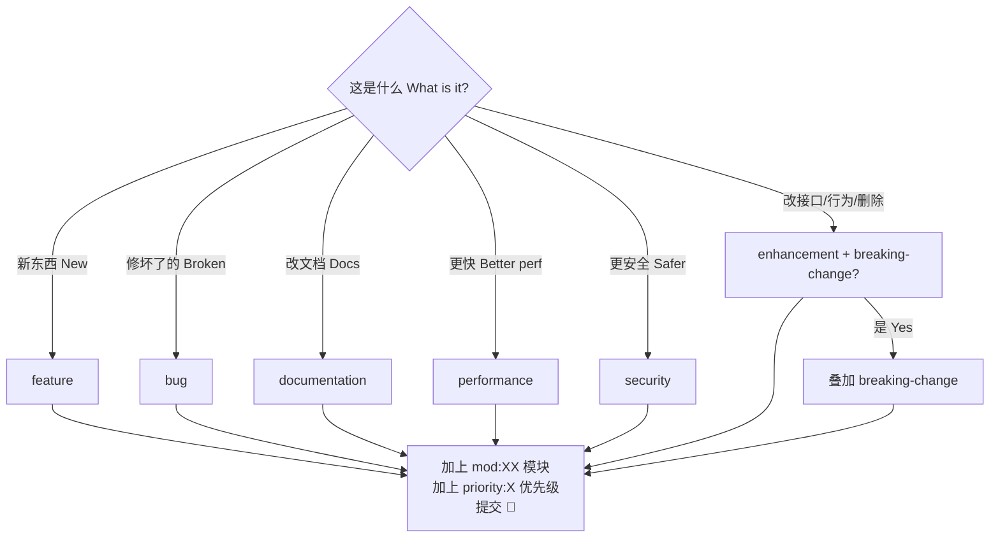

<div align="center">

# 标签规范详解 | Label Policy Reference

> **_YanYuCloudCube_**
> _言启象限 | 语枢未来_
> **_Words Initiate Quadrants, Language Serves as Core for Future_**
> _万象归元于云枢 | 深栈智启新纪元_
> **_All things converge in cloud pivot; Deep stacks ignite a new era of intelligence_**

</div>

> 版本 v1.0.0 · 2026-09-18 · 机器可读清单 [`.github/labels.json`](../../.github/labels.json)（可用 [github-label-sync](https://github.com/Financial-Times/github-label-sync) 一键同步）
> 标签疑问 label questions: <dev@yanyucloud.com>

---

## 一、标签分类 | Taxonomy

### 1.1 类型标签 | Type Labels（主类型唯一 unique primary）

| Label | 颜色 Color | 中文 | English |
| ------- | ----------- | ------ | --------- |
| `feature` | 🟩 `0E8A16` | 新功能 | New feature |
| `enhancement` | 🟦 `A2EEEF` | 现有功能增强 | Enhancement to existing behavior |
| `bug` | 🟥 `D73A4A` | 缺陷 | Defect / regression |
| `documentation` | 🟦 `0075CA` | 文档与知识库 | Docs & knowledge base |
| `performance` | 🟧 `FB9050` | 性能优化 | Performance improvement |
| `security` | 🟥 `B60205` | 安全与合规 | Security & compliance |
| `ci` | 🟦 `1D76DB` | CI/CD 流水线 | Pipeline & tooling |
| `breaking-change` | 🟧 `D93F0B` | 破坏性变更 | Breaking change, needs migration notes |

### 1.2 优先级 | Priority（恰好一个 exactly one）

| Label | 含义 Meaning | 响应目标 SLO |
| ------- | ------------- | ------------- |
| `priority:critical` | P0 阻断生产 | 立即应急 immediate |
| `priority:high` | P1 当迭代 | 本迭代内 within sprint |
| `priority:medium` | P2 排期 | 2 个迭代内 within 2 sprints |
| `priority:low` | P3 积压 | 择期 backlog |

### 1.3 状态 | Status（仅维护者 maintainer-only）

`status:needs-triage` → `status:triaged` → `status:in-progress` → `status:needs-review` → ✅ 关闭 closed

旁路 bypass: `status:blocked` / `status:awaiting-feedback` / `status:duplicate` / `status:wontfix`

### 1.4 模块 | Module（≤ 3 个可叠加 stackable）

按六大功能域 + 基础设施划分 by six functional domains + infra:

| Label | 模块 Module | 覆盖范围 Scope |
| ------- | ------------ | --------------- |
| `mod:monitor` | 监控中心 Monitoring Center | 数据监控 / 一键跟进 / 巡查模式 / 告警规则 |
| `mod:ops` | 运维管理 Operations | 操作中心 / 文件管理 / 数据库管理 / 闭环 / 报表导出 |
| `mod:ai` | AI 智能 AI Intelligence | API 矩阵与模型管理 / AI 辅助决策 / AI 诊断 |
| `mod:family` | AI Family | 12 小时钟盘 / Family 中心 / 语音 / 成长 / 文娱 |
| `mod:devstd` | 开发规范 Dev Standards | 设计系统 / 开发指南 / 架构审计 |
| `mod:admin` | 系统管理 Administration | 审计 / 用户 / 安全监控 / PWA / 环境变量 / 系统设置 |
| `mod:infra` | 基础设施 Infra | workflows / deploy / scripts / 构建配置 |
| `mod:icons` | 图标体系 Icon System | yyc3-icons / manifest / PWA 图标链路 |
| `mod:docs` | 开发者文档 Dev docs | docs/YYC3-开发者文档 + 标规文档 |

### 1.5 社区 | Community

`good-first-issue` · `help-wanted` · `hacktoberfest`

---

## 二、使用规则 | Usage Rules

1. **Issue 必选**: 1 类型 + 1 模块 + 1 优先级；模板会预置 `status:needs-triage`。
   Issue requires: type + module + priority; templates pre-set `status:needs-triage`.
2. **PR 必选**: 1 类型 + 1 模块；标题 = Conventional Commits。
   PR requires: type + module; title follows Conventional Commits.
3. **breaking-change**: 叠加 `priority:critical|high` + 迁移说明。
   Add high priority + migration notes.
4. **状态标签**: 贡献者勿动，维护者流转。
   Status labels are maintainer-managed.
5. **合并约束**: PR 合并前必须 ≥ 1 类型 + 1 模块标签（CI 可扩展校验）。
   Merging requires at least type + module labels.

---

## 三、一键同步 | One-Command Sync

```bash
# 安装同步工具 Install
npx github-label-sync \
  --labels .github/labels.json \
  --allow-added-labels \
  YYC-Cube/YYC3-AI-API-Token-Console
```

> 需要 repo admin 权限的 GitHub Token（`GITHUB_TOKEN` 环境变量）。
> Requires a GitHub token with repo admin (`GITHUB_TOKEN` env var).

---

## 四、决策速查 | Quick Decision Tree



---

## 五、与 Conventional Commits 映射 | Commit Type Mapping

| Commit type | 对应标签 Label |
|-------------|----------------|
| `feat` | `feature` |
| `fix` | `bug` |
| `docs` | `documentation` |
| `perf` | `performance` |
| `refactor` | `enhancement` |
| `test` | —（可叠加所属模块） |
| `ci` | `ci` |
| `chore` | —（可叠加所属模块） |

---

<div align="center">

**® YANYUCLOUDCUBE** · © 2025-2026 言语（河南）智能科技有限公司 · Yanyu Intelligent Technology Co., Ltd.

</div>
