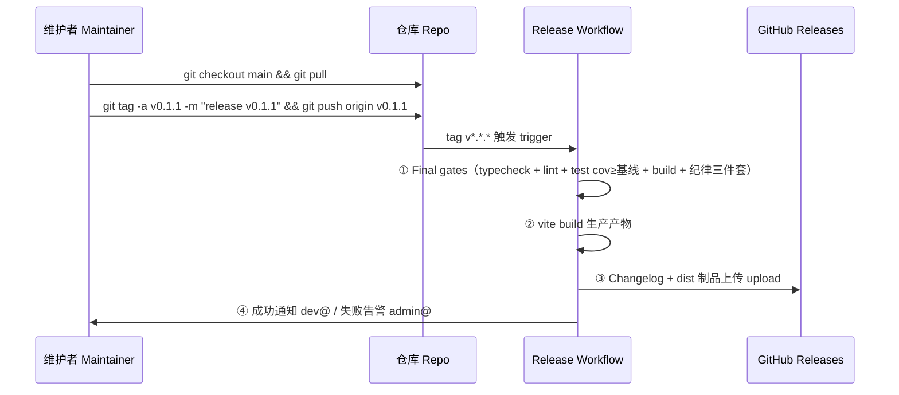

<div align="center">

# 发布流程 | Release Process

> **_YanYuCloudCube_**
> _言启象限 | 语枢未来_
> **_Words Initiate Quadrants, Language Serves as Core for Future_**
> _万象归元于云枢 | 深栈智启新纪元_
> **_All things converge in cloud pivot; Deep stacks ignite a new era of intelligence_**

</div>

> 版本 v1.0.0 · 2026-09-18 · 版本语义 SemVer 2.0.0 · 触发方式 tag-driven
> 维护联系 maintainer contact: <admin@yanyucloud.com> · 发布失败告警 failure alerts: <admin@yanyucloud.com>

---

## 一、版本语义 | Versioning Semantics

```text
v MAJOR . MINOR . PATCH
   │       │       └─ 修复/笔误 bug fixes, typos
   │       └─ 新功能/新文档 new features, new docs
   └─ 破坏性变更 breaking changes（必须附迁移说明 with migration notes）
```

- 预发布 Pre-release: `v1.1.0-rc.1` / `v1.1.0-beta.2`（Release 页标记 prerelease）
- 构建元数据: `+build.sha`（仅内部标识，不参与优先级比较）
- 当前基线 Current baseline: `v0.1.0`（package.json，初始发布前演进期）

---

## 二、发布前置检查单 | Pre-Release Checklist

- [ ] CI 在 `main` 上全绿（typecheck / test / security-scan / build）All CI checks green on `main`
- [ ] [`CHANGELOG.md`](./CHANGELOG.md) 已更新本版本条目（Added/Changed/Fixed/Removed/Security）CHANGELOG updated
- [ ] 版本号已按语义提升并同步至 `package.json` Version bumped per SemVer
- [ ] `breaking-change` 条目均有迁移文档 Breaking entries have migration docs
- [ ] PWA `manifest.json` 版本相关字段核对（如 name/version 语义变化）Manifest sanity check

---

## 三、发布流程 | Release Flow



**命令速查 | Command quickref**

```bash
# 1. 确认 main 就绪 ensure main is green
git checkout main && git pull && gh run watch

# 2. 打标签并推送 tag & push
git tag -a v0.1.1 -m "release v0.1.1" && git push origin v0.1.1

# 3. 观察发布流水线 watch the pipeline
gh run watch
```

---

## 四、发布后动作 | Post-Release

1. 核对 Release 页制品完整性（dist 产物 / changelog）Verify artifacts
2. `pnpm deploy` 本地拉起 server.mjs 做冒烟（:3118 + Ollama 代理探测）Smoke-test locally
3. 向 <dev@yanyucloud.com> 群发版本通告 Broadcast announcement
4. 如需回填 develop：`git checkout develop && git merge main` Back-merge if needed

---

## 五、回滚 | Rollback

| 场景 Scenario | 动作 Action |
| --------------- | ------------ |
| 构建产物缺陷 Defective build | 部署回退上一 tag 产物（dist 归档于 Releases，重新分发 repin） |
| Release 内容有误 Wrong release | 删除 Release + tag，修复后以**新版本号**重发；禁止复用已发布版本号 Delete release & tag, re-issue with a NEW version — never reuse |
| 仅文档错误 Docs-only mistake | 直接以 PATCH 版本重发（docs 变更属 MINOR/PATCH 视内容） |

---

## 六、变更日志规范 | Changelog Convention

格式基于 [Keep a Changelog](https://keepachangelog.com/zh-CN/1.1.0/)，段落固定五节：

```markdown
## [x.y.z] - YYYY-MM-DD
### Added 新增
### Changed 变更
### Fixed 修复
### Removed 移除
### Security 安全
```

---

<div align="center">

**® YANYUCLOUDCUBE** · © 2025-2026 言语（河南）智能科技有限公司 · Yanyu Intelligent Technology Co., Ltd.

</div>
