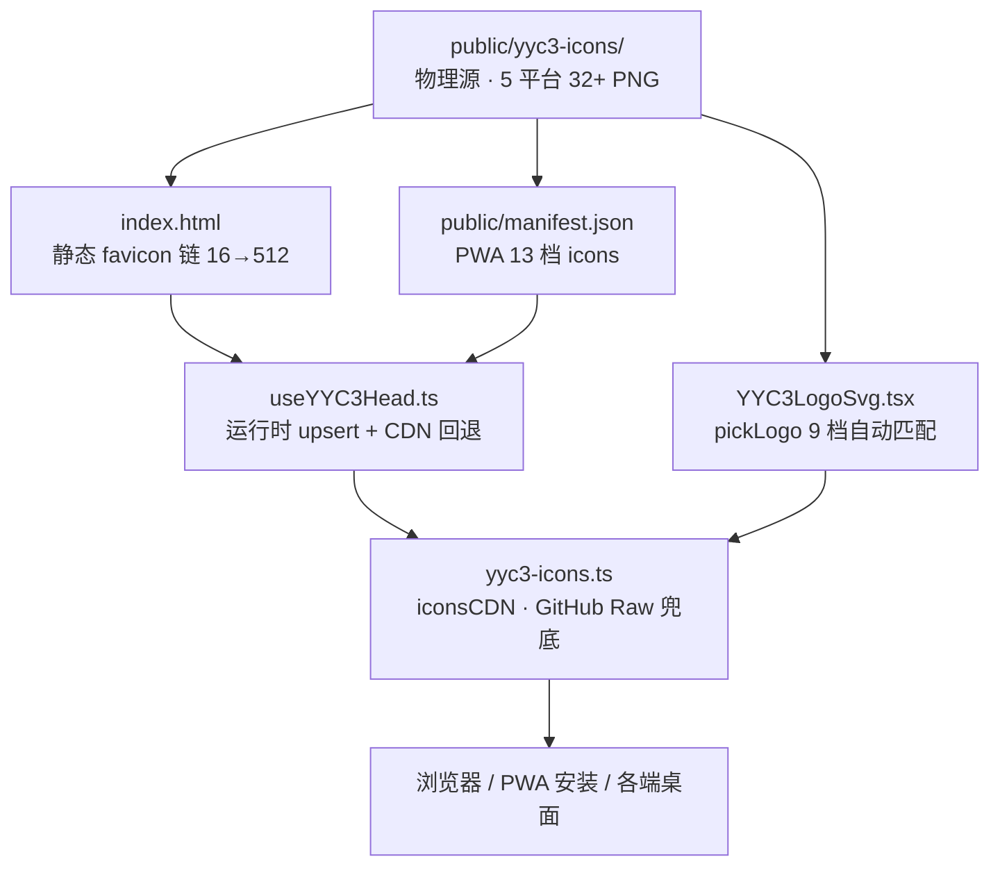

<div align="center">

# 图标可视化架构展示 | Icon Visualization Architecture

> **_YanYuCloudCube_**
> _言启象限 | 语枢未来_
> **_Words Initiate Quadrants, Language Serves as Core for Future_**
> _万象归元于云枢 | 深栈智启新纪元_
> **_All things converge in cloud pivot; Deep stacks ignite a new era of intelligence_**

</div>

> 五维驱动落地：**时间维**（按需加载分级）· **空间维**（目录即拓扑）· **属性维**（尺寸/用途/格式完备）· **事件维**（onError CDN 回退）· **关联维**（五端链路贯通）
>
> 上游标准：《YYC3-图标可视化-体系设计》（`docs/YYC3-AI-Family-团队规范/标规文档/`，本地参考，不入远程库）— 本文档为项目实例化展示层。

---

## 一、五平台资产矩阵 | Five-Platform Asset Matrix

### 1.1 目录拓扑（空间维）| Directory Topology

```
public/yyc3-icons/
├── Android/                     6 文件 — 启动器与商店
│   ├── mdpi.png        48×48
│   ├── hdpi.png        72×72
│   ├── xhdpi.png       96×96
│   ├── xxhdpi.png     144×144
│   ├── xxxhdpi.png    192×192
│   └── Play Store.png 512×512
├── Web App/                     5 文件 — 浏览器与 PWA
│   ├── favicon-16.png          16×16
│   ├── favicon-32.png          32×32
│   ├── apple-touch-icon.png   180×180
│   ├── android-chrome-192.png 192×192 (any + maskable)
│   └── android-chrome-512.png 512×512 (any + maskable)
├── iOS/                         7 文件 — 主屏/通知/Spotlight
│   ├── App Store.png         1024×1024
│   ├── iPad App.png            76×76
│   ├── iPad Spotlight.png      40×40
│   └── iPhone Notification 2x/3x · iPhone Spotlight 2x/3x
├── macOS/                       7 文件 — 桌面全尺寸
│   └── 16/32/64/128/256/512/1024.png
└── watchOS/                     4 文件 — 表盘与通知
    ├── App Store.png         1024×1024
    ├── Home Screen.png         80×80
    ├── Notification.png        48×48
    └── Short Look.png         172×172
```

### 1.2 平台 × 尺寸矩阵（属性维）| Platform × Size Matrix

| 平台 | 16 | 32 | 48 | 64 | 72 | 76 | 80 | 96 | 128 | 144 | 172 | 180 | 192 | 256 | 512 | 1024 |
| ---- | -- | -- | -- | -- | -- | -- | -- | -- | --- | --- | --- | --- | --- | --- | --- | ---- |
| Web App | ✅ | ✅ | — | — | — | — | — | — | — | — | — | ✅ | ✅ | — | ✅ | — |
| Android | — | — | ✅ | — | ✅ | — | — | ✅ | — | ✅ | — | — | ✅ | — | ✅ | — |
| iOS | — | — | — | — | — | ✅ | ✅ | — | — | — | — | — | ✅* | — | — | ✅ |
| macOS | ✅ | ✅ | — | ✅ | — | — | — | — | ✅ | — | — | — | — | ✅ | ✅ | ✅ |
| watchOS | — | — | ✅ | — | — | — | ✅ | — | — | — | ✅ | — | — | — | — | ✅ |

\* iOS 192 由 iPhone Spotlight 3x (120) 与 Notification 3x 组合覆盖 PWA 场景。

---

## 二、全端消费链路（关联维）| Consumption Chain



### 2.1 六层职责表 | Six-Layer Responsibility

| 层级 | 文件 | 职责 | 失败兜底 Fallback |
| ---- | ---- | ---- | ----------------- |
| L0 物理 | `public/yyc3-icons/*.png` | 唯一资产源 Single source of truth | — |
| L1 静态 | [`index.html`](../../index.html) | 首屏 favicon/manifest，无 JS 依赖 | 浏览器默认 |
| L2 清单 | [`public/manifest.json`](../../public/manifest.json) | PWA 安装 13 档图标 | Chrome 拒装时回退 L1 |
| L3 运行时 | [`useYYC3Head.ts`](../../src/app/hooks/useYYC3Head.ts) | upsert link/meta + OG + CDN onerror | L1 已保证 |
| L4 逻辑 | [`lib/yyc3-icons.ts`](../../src/app/lib/yyc3-icons.ts) | `icons` / `iconsCDN` / `handleIconError` / `pwaManifestIcons` | 单一事实源 |
| L5 组件 | [`YYC3LogoSvg.tsx`](../../src/app/components/YYC3LogoSvg.tsx) | `pickLogo(size)` 9 档自动匹配 | — |

---

## 三、路径规范（事件维）| Path Convention

| 场景 | 规则 | 示例 |
| ---- | ---- | ---- |
| HTML/manifest 静态引用 | URL 编码空格 `%20` 或原样空格（现代服务器均支持） | `/yyc3-icons/Web App/favicon-32.png` |
| React `` | 模板字符串 + 空格原样 | `` `${BASE}/Web App/favicon-16.png` `` |
| CDN（GitHub Raw） | 末段 `encodeURIComponent`，目录段保留 | `cdnPath("Web App/favicon-16.png")` |
| 禁止 | ❌ 硬编码 `yyc3-badge-icons`（历史目录，已迁移） | — |

---

## 四、消费方式速查 | Usage Quick Reference

```tsx
// 1. 组件内嵌 Logo（自动选档 16→512）
import { YYC3LogoSvg } from "@/app/components/YYC3LogoSvg";
<YYC3LogoSvg size={40} />

// 2. 直接引用 + CDN 回退
import { icons, iconsCDN, handleIconError } from "@/app/lib/yyc3-icons";


// 3. <head> 全端注入（App 根组件已调用）
import { useYYC3Head } from "@/app/hooks/useYYC3Head";
useYYC3Head();
```

---

## 五、可视化展示规范 | Visualization Guidelines

| 场景 | 最小尺寸 | 推荐格式 | 备注 |
| ---- | -------- | -------- | ---- |
| 侧边栏品牌位 | 40×40 | `@2x` 物理像素 | `YYC3LogoSvg size={40}` |
| 登录页主视觉 | 128×128 | macOS/128.png | 居中 + 品牌色底 |
| README 顶图 | 原尺寸 | `public/yyc3-Family.png` | `width="100%"` 不写死像素 |
| 徽章系统 | shields.io 标准高度 20px | SVG 外链 | 见 [README 徽章区](../../README.md) |
| PWA 启动屏 | 512 maskable | android-chrome-512 | `purpose: "any maskable"` |

---

## 六、新增/替换图标流程 | Change Workflow

1. **放入物理源**：按平台放入 `public/yyc3-icons/{平台}/`，命名遵循平台惯例
2. **登记逻辑源**：在 `src/app/lib/yyc3-icons.ts` 的 `icons` / `iconsCDN` / `REMOTE_FILE_MANIFEST` 三处同步登记
3. **更新清单**：如涉及 PWA，同步 `public/manifest.json` 的 `icons` 数组（sizes 必须与真实像素一致）
4. **质量门禁**：`pnpm typecheck && pnpm test`，图标相关测试（`YYC3Logo.test.tsx`）必须通过
5. **文档闭环**：更新本文档矩阵表与 README 图标章节，并按 [标签规范](./LABELS.md) 打 `mod:icons` 标签

---

## 七、验收清单 | Acceptance Checklist

- [x] `public/yyc3-icons/` 五平台目录完整（32+ PNG）
- [x] `index.html` favicon 链 16→512 全覆盖 + apple-touch 180
- [x] `manifest.json` 13 档图标路径与物理源 1:1
- [x] `yyc3-icons.ts` LOCAL_BASE / GH_BASE 双基址对齐 `yyc3-icons`
- [x] `YYC3LogoSvg.tsx` 9 档自动选型，无 figma:asset 虚拟依赖
- [x] `useYYC3Head.ts` 运行时注入 + CDN onerror 回退
- [x] 全仓无 `yyc3-badge-icons` 断链引用（仅历史审计文档记录性文字保留）

---

<div align="center">

**® YANYUCLOUDCUBE** · © 2025-2026 言语（河南）智能科技有限公司 · Yanyu Intelligent Technology Co., Ltd.

</div>
